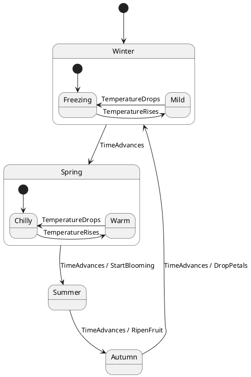

# Phyto FSM

A Rust procedural macro for generating state machines from PlantUML diagrams.

[](https://github.com/TobTheRock/phytofsm/actions/workflows/ci.yml)
[](https://crates.io/crates/phyto-fsm)
[](https://docs.rs/phyto-fsm)

## Overview

Many state machine frameworks provide the possibility to create a visualization from your FSM
defined by the source code, which then can be e.g. added to your documentation.
`phyto-fsm` does it the opposite way:

- you create a visual representation of an FSM using a [PlantUML state diagram](https://plantuml.com/state-diagram)
- `phyto-fsm`
  - parses the diagram during compile time
  - generates a type-safe FSM representation as well as a trait to handle actions such as on transitions
- using the generated trait you define the actions to take on transitions

This way the design of the FSM is easy to grasp first hand and documentation and source code are always inline.

## State Machine Features

| Feature | Description | Example |
|---------|-------------|---------|
| Events with custom data | Trigger transitions with typed event parameters | [actions.rs](https://github.com/TobTheRock/phytofsm/blob/main/tests/actions.rs) |
| Custom data types | Use any type (primitives, structs, references, pointers) as event data | [data_types.rs](https://github.com/TobTheRock/phytofsm/blob/main/tests/data_types.rs) |
| Actions on transitions | Execute custom code when transitions occur | [actions.rs](https://github.com/TobTheRock/phytofsm/blob/main/tests/actions.rs) |
| Composite states | Nested/hierarchical states with automatic enter state resolution | [composite_states.rs](https://github.com/TobTheRock/phytofsm/blob/main/tests/composite_states.rs) |
| Substate-to-substate transitions | Transitions between substates across different parent states | [substate_to_substate.rs](https://github.com/TobTheRock/phytofsm/blob/main/tests/substate_to_substate.rs) |
| Self-transitions | States that transition to themselves | [transitions.rs](https://github.com/TobTheRock/phytofsm/blob/main/tests/transitions.rs) |
| Alternative transitions | Multiple transitions from the same state with different events | [transitions.rs](https://github.com/TobTheRock/phytofsm/blob/main/tests/transitions.rs) |
| Transition logging | Optional logging via [log](https://docs.rs/log/latest/log/) crate | [four_seasons.rs](https://github.com/TobTheRock/phytofsm/blob/main/tests/four_seasons.rs) |

### Missing Features

- enter/exit actions
- exit state
- guards
- event deferring
- sub state machines
- history states

## Generated Code Naming Conventions

When you use `generate_fsm!("path/to/diagram.puml")`, the macro generates various traits, enums, and structs based on your PlantUML diagram name and elements. Here's how they are named:

### Core Generated Types

For a PlantUML diagram whose name is given by:

```
@startuml DiagramName
...
@enduml
```

The following is generated:

| Generated Item | Naming Pattern | Description |
|---------------|----------------|-------------|
| **FSM Struct** | `{DiagramName}` | Main state machine struct (UpperCamelCase) |
| **Event Parameters Trait** | `I{DiagramName}EventParams` | Trait defining event parameter types |
| **Actions Trait** | `I{DiagramName}Actions` | Trait defining action methods |
| **State Struct** | `{DiagramName}State` | Internal state representation |
| **Module** | `{diagram_name}` | Generated module name (snake_case) |

### Event and Action Elements

The actions and events associated with a transition must be defined as such with PlantUML:

```
StateA --> StateB : EventName / ActionName
```

- **EventName** becomes the event that triggers the transition
- **ActionName** (optional) becomes the method called during the transition
- Use `/` to separate the event from the action

| PlantUML Element | Generated Item | Naming Pattern |
|-----------------|----------------|----------------|
| **Event** | Method name | snake_case of event name |
| **Event** | Parameter type | `{EventName}Params` |
| **Action** | Method name | snake_case of action name |
| **State** | State name | Preserved as written in PlantUML |
| **State** | Function name | snake_case of state name |

## Example

### 1. Create a PlantUML state diagram



### 2. Generate the state machine

```rust
use phyto_fsm::generate_fsm;

// Generate FSM from PlantUML file
generate_fsm!(
    file_path = "path/to/your/diagram.puml",
    log_level = "debug"  // Optional: enables transition logging
);
```

### 3. Implement your actions

```rust
use plant_fsm::{IPlantFsmActions, IPlantFsmEventParams, NoEventData};

struct PlantActions;

impl IPlantFsmEventParams for PlantActions {
    type TimeAdvancesParams = std::time::SystemTime;
    type TemperatureRisesParams = NoEventData;
    type TemperatureDropsParams = NoEventData;
}

impl IPlantFsmActions for PlantActions {
    fn start_blooming(&mut self, time: Self::TimeAdvancesParams) {
        println!("Started blooming at {:?}", time);
    }

    fn ripen_fruit(&mut self, _: Self::TimeAdvancesParams) {
        println!("Fruit is ripening");
    }

    fn drop_petals(&mut self, _: Self::TimeAdvancesParams) {
        println!("Dropping petals");
    }
}
```

### 4. Use your state machine

```rust
use plant_fsm::PlantFsm;

fn main() {
    let actions = PlantActions;
    let mut fsm = PlantFsm::new(actions);

    // Transition within Winter: Freezing -> Mild
    fsm.temperature_rises(());

    // Transition to next season: Winter -> Spring (enters Spring::Chilly)
    fsm.time_advances(std::time::SystemTime::now());
}
```
