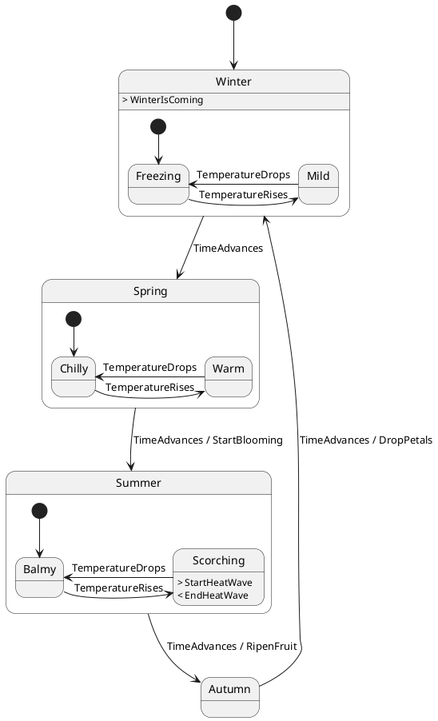

# Phyto FSM

A Rust procedural macro for generating state machines from PlantUML diagrams.

[](https://github.com/TobTheRock/phytofsm/actions/workflows/ci.yml)
[](https://crates.io/crates/phyto-fsm)
[](https://docs.rs/phyto-fsm)

## Overview

Many state machine frameworks provide the possibility to create a visualization from your FSM
defined by the source code, which then can be e.g. added to your documentation.
`phyto-fsm` does it the opposite way:

- you create a visual representation of an FSM using a [PlantUML state diagram](https://plantuml.com/state-diagram)
- `phyto-fsm`
  - parses the diagram during compile time
  - generates a type-safe FSM representation as well as a trait to handle actions such as on transitions
- using the generated trait you define the actions to take on transitions

This way the design of the FSM is easy to grasp first hand and documentation and source code are always inline.

## State Machine Features

| Feature | Description | Example |
|---------|-------------|---------|
| Events with custom data | Trigger transitions with typed event parameters | [actions.rs](https://github.com/TobTheRock/phytofsm/blob/main/tests/actions.rs) |
| Custom data types | Use any type (primitives, structs, references, pointers) as event data | [data_types.rs](https://github.com/TobTheRock/phytofsm/blob/main/tests/data_types.rs) |
| Actions on transitions | Execute custom code when transitions occur | [actions.rs](https://github.com/TobTheRock/phytofsm/blob/main/tests/actions.rs) |
| Enter/exit actions | Execute custom code when entering or exiting a state | [enter_exit.rs](https://github.com/TobTheRock/phytofsm/blob/main/tests/enter_exit.rs) |
| Composite states | Nested/hierarchical states with automatic enter state resolution | [composite_states.rs](https://github.com/TobTheRock/phytofsm/blob/main/tests/composite_states.rs) |
| Substate-to-substate transitions | Transitions between substates across different parent states | [substate_to_substate.rs](https://github.com/TobTheRock/phytofsm/blob/main/tests/substate_to_substate.rs) |
| Self-transitions | States that transition to themselves | [transitions.rs](https://github.com/TobTheRock/phytofsm/blob/main/tests/transitions.rs) |
| Alternative transitions | Multiple transitions from the same state with different events | [transitions.rs](https://github.com/TobTheRock/phytofsm/blob/main/tests/transitions.rs) |
| Transition logging | Optional logging via [log](https://docs.rs/log/latest/log/) crate | [four_seasons.rs](https://github.com/TobTheRock/phytofsm/blob/main/tests/four_seasons.rs) |

### Missing Features

- internal transitions
- guards
- run to completion model (RTC), currently events in transitions are UB
- exit state
- event deferring
- sub state machines
- history states
- orthogonal regions

## Custom Syntax for FSM Actions & Events

This library extends standard PlantUML state diagram syntax with custom notation for defining actions.

### Transitions with Actions

Transitions can optionally include an action that is executed when the transition occurs:

```puml
StateA --> StateB : EventName / ActionName
```

- **EventName**: The event that triggers the transition
- **ActionName** (optional): The action method called during the transition seperated by `/`

### Enter/Exit Actions

States can define enter and exit actions using the state description syntax with special prefixes:

```puml
State MyState : > EnterActionName
State MyState : < ExitActionName
```

- **`>`** prefix denotes an **enter action** - called when entering the state
- **`<`** prefix denotes an **exit action** - called when leaving the state

Enter and exit actions can also be defined within composite states:

```puml
state Parent {
  Parent: > EnterParent
  Parent: < ExitParent

  state Child : > EnterChild
  state Child : < ExitChild

  [*] --> Child
}
```

**Execution order:**

Following the [UML specification](https://www.omg.org/spec/UML/2.5.1/PDF), exit actions are always executed before enter actions during a transition:

1. **Exit** the source state (and its parents, from innermost to outermost)
2. **Enter** the target state (and its parents, from outermost to innermost)

Furthermore:

- Internal transitions (between substates of the same parent) do not trigger the parent's enter/exit actions
- Self-transitions trigger both exit and enter actions (exit first, then enter)

## Generated Code

When you use `generate_fsm!("path/to/diagram.puml")`, the macro generates various traits, enums, and structs based on your PlantUML diagram name and elements. Here's how they are named:

### Core Generated Types

For a PlantUML diagram whose name is given by:

```
@startuml DiagramName
...
@enduml
```

The following is generated:

| Generated Item | Naming Pattern | Description |
|---------------|----------------|-------------|
| **FSM Struct** | `{DiagramName}` | Main state machine struct (UpperCamelCase) |
| **Event Parameters Trait** | `I{DiagramName}EventParams` | Trait defining event parameter types |
| **Actions Trait** | `I{DiagramName}Actions` | Trait defining action methods |
| **State Struct** | `{DiagramName}State` | Internal state representation |
| **Module** | `{diagram_name}` | Generated module name (snake_case) |

### Events and Actions

From the elements given by the custom syntax the following is derived:

| PlantUML Element | Generated Item | Naming Pattern |
|-----------------|----------------|----------------|
| **Event** | Method name of the FSM Struct | snake_case of event name |
| **Event** | Parameter type | `{EventName}Params` |
| **Action** (Transition/Enter/Exit) | Method name of the Actions Trait | snake_case of action name |
| **State** | State name | Preserved as written in PlantUML |

## Example

### 1. Create a PlantUML state diagram



### 2. Generate the state machine

```rust
use phyto_fsm::generate_fsm;

// Generate FSM from PlantUML file
generate_fsm!(
    file_path = "path/to/your/diagram.puml",
    log_level = "debug"  // Optional: enables transition logging
);
```

### 3. Implement your actions

```rust
use plant_fsm::{IPlantFsmActions, IPlantFsmEventParams, NoEventData};

struct PlantActions;

impl IPlantFsmEventParams for PlantActions {
    type TimeAdvancesParams = std::time::SystemTime;
    type TemperatureRisesParams = NoEventData;
    type TemperatureDropsParams = NoEventData;
}

impl IPlantFsmActions for PlantActions {
    // Transition actions
    fn start_blooming(&mut self, time: Self::TimeAdvancesParams) {
        println!("Started blooming at {:?}", time);
    }

    fn ripen_fruit(&mut self, _: Self::TimeAdvancesParams) {
        println!("Fruit is ripening");
    }

    fn drop_petals(&mut self, _: Self::TimeAdvancesParams) {
        println!("Dropping petals");
    }

    // Enter actions
    fn winter_is_coming(&mut self) {
        println!("Brace yourselves, winter is coming!");
    }

    fn start_heat_wave(&mut self) {
        println!("Heat wave starting!");
    }

    // Exit actions
    fn end_heat_wave(&mut self) {
        println!("Heat wave ending, cooling down...");
    }
}
```

### 4. Use your state machine

```rust
use plant_fsm::PlantFsm;

fn main() {
    let actions = PlantActions;
    // Creating the FSM triggers winter_is_coming() enter action
    let mut fsm = PlantFsm::start(actions);

    // Transition within Winter: Freezing -> Mild
    fsm.temperature_rises(());

    // Transition to next season: Winter -> Spring (enters Spring::Chilly)
    fsm.time_advances(std::time::SystemTime::now());

    // Transition to Summer, then enter Scorching (triggers start_heat_wave)
    fsm.time_advances(std::time::SystemTime::now());
    fsm.temperature_rises(());

    // Leave Scorching (triggers end_heat_wave), go to Balmy
    fsm.temperature_drops(());
}
```
